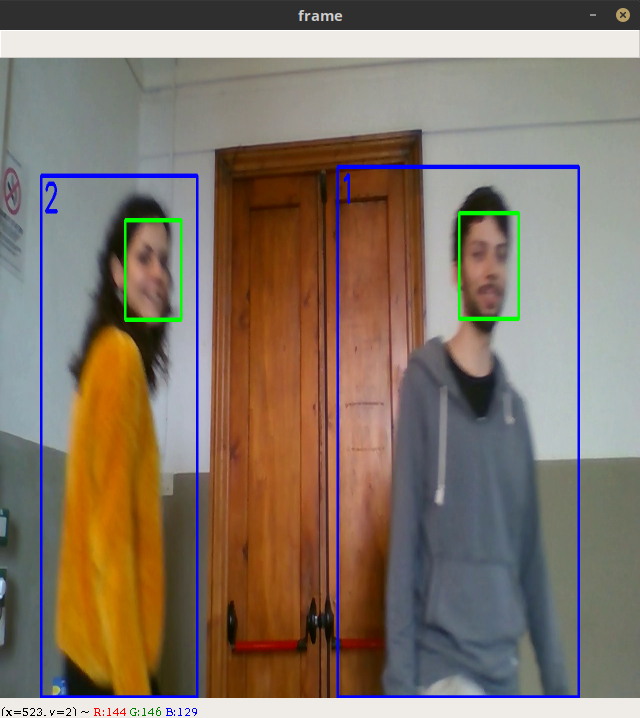
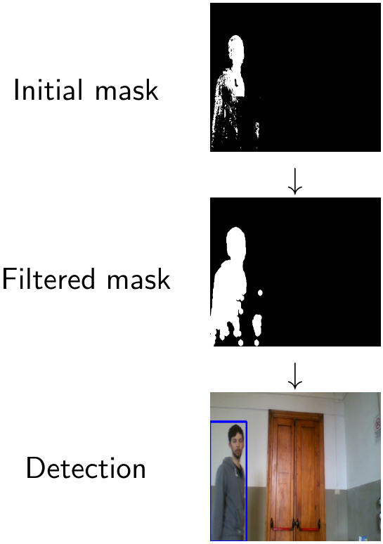
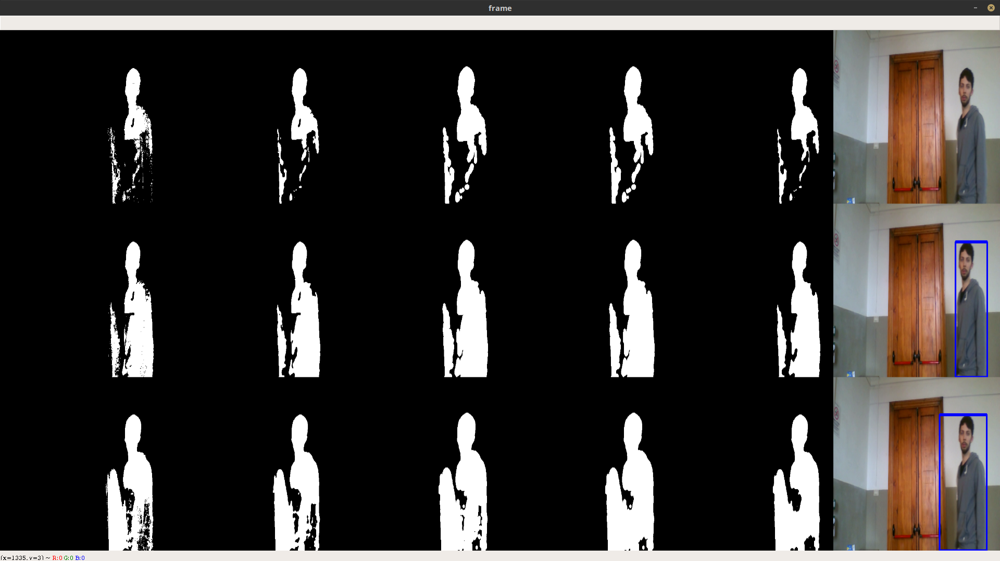
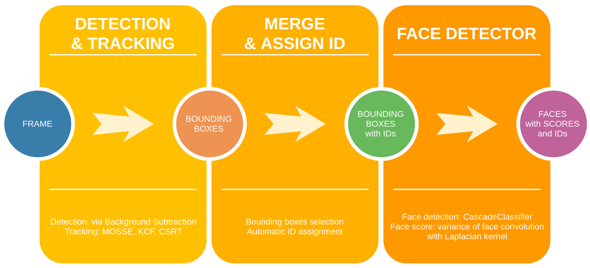
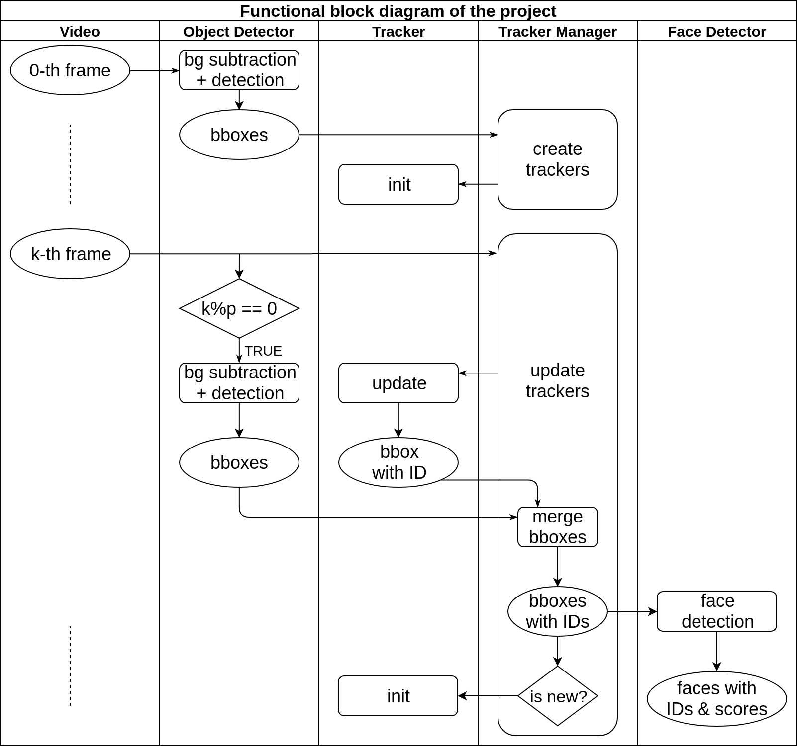

# Video object tracking and face detection

This project aims at tracking the objects in a video and, in case they are people, find the faces of them.
We assign an identifier to each object and, for each of them, the best faces found are saved on the disk.

## Installation

+ clone the repository
+ ensure you have all packages listed in "requirements.txt"

## Track objects and detect faces in a video

+ `python3 main_tracking.py`
+ an output folder will be created with all faces detected in the video (each one belonging to a specific object, and evaluated with a sharpness measure)
+ additional: to try another tracker or another video, just change the first lines of code in main function of tracker.py script

## Under the hood
### Object detector
Of course, to operate the tracker needs a good object detector.
In this implementation, to achieve object detection we take advantage of background subtraction in this way:

+ apply background subtraction to the frame of the video, obtaining a binary mask of foreground/background
+ filter the mask in order to remove noise (e.g.: median blur smoothing) and to avoid object splitting (e.g.: apply dilation morphological operator)
+ as objects we consider all large enough contours of the filtered mask, from which we retrieve the corresponding bounding box

The output of each step is graphically represented by the following image:

You can try different background subtraction algorithms and mask filtering techniques using the script `main_background_subtraction.py`.
This script shows in real time different outputs obtained by the specified background subtraction algorithms (one row for each of them in the following image),
with details of the intermediate outputs (one column for each intermediate mask filtering in the following image).

If you want to use a different detector (e.g.: a Convolutional Neural Network), to interface it with this project you simply have to implement a *detect* method: check ObjectDetector class inside `object_detector.py`.

Remark: background subtraction can be used only in the case in which the camera is static; if instead the camera moves during the video recording, other techniques must be considered to locate the objects.

### Object tracker
By changing a few lines of code (about tracker initialization, inside `tracker.py`), all OpenCV tracking algorithms[1](#note1) can be used. We tried these three:

+ MOSSE (Minimum Output Sum of Squared Error, 2010) [2](#note2)
+ KCF (Kernelized Correlation Filters, 2014) [3](#note3)
+ CSRT (Channel and Spatial Reliability Tracker, 2017) [4](#note4)

We realized that:

+ about tracking quality: CSRT > KCF > MOSSE
+ about computational efficiency: CSRT < KCF < MOSSE

### Face detector
Face detection is made using a pre-trained Haar Cascades Classifier[5](#note5).
We don't just want to find faces, we want to find the best faces. As a quality score of a face photo, we use the variance of the convolution of the face image with Laplacian kernel[6](#note6).

### Putting all together
To use both detection and tracking, we decide to:

+ make detection once every a period of *p* frames
+ track detected objects until they disappear or stop: with tracking it's easy to maintain objects IDs
+ in frames where both detection and tracking are performed, we have to merge the two sets of bounding boxes, deciding which to maintain

We observed that:

+ using detector based on background subtraction, a short period is better
+ in frames where an object has a bounding box given by the tracker and a bounding box given by the detector, is usually better to maintain the detector's bounding box

The following image summarizes (at high level) the steps that are taken starting from a frame of the video up to the localization of the face.

More details on the steps taken to reach the target are represented by the following functional block diagram:

## More about this project
This project was carried out as part of the "Image and Video Analysis" exam of the master's degree in computer science engineering at the University of Florence.
Another part of the exam consisted of giving two lectures to the other students: one on the theory of tracking algorithms and one as a laboratory exercise to understand the salient parts of this project.
The slides of these lectures are inside "lectures" folder.

## References

+ <a name="note1">[1]</a> OpenCV tracking API: https://docs.opencv.org/4.1.0/d9/df8/group__tracking.html
+ <a name="note2">[2]</a> David S. Bolme, J. Ross, Beveridge Bruce, A. Draper, Yui Man Lui: *Visual Object Tracking using Adaptive Correlation Filters* (2010)
+ <a name="note3">[3]</a> João F. Henriques, Rui Caseiro, Pedro Martins, Jorge Batista: *High-Speed Tracking with Kernelized Correlation Filters* (2014)
+ <a name="note4">[4]</a> Alan Lukezic, Tom'as Voj'ir, Luka Cehovin Zajc, Jir'i Matas, Matej Kristan: *Discriminative correlation filter tracker with channel and spatial reliability* (2017)
+ <a name="note5">[5]</a> Face detection using Haar Cascades Classifier: https://docs.opencv.org/4.1.0/d7/d8b/tutorial_py_face_detection.html
+ <a name="note6">[6]</a> Blur detection with OpenCV: https://www.pyimagesearch.com/2015/09/07/blur-detection-with-opencv
